# Testing

Go back to [README.md](README.md)

## Code Validation

### HTML

Results from [HTML W3C Validator](https://validator.w3.org)

| Page         | Screenshot                           | Notes                       |
|--------------|--------------------------------------|-----------------------------|
| Home         | 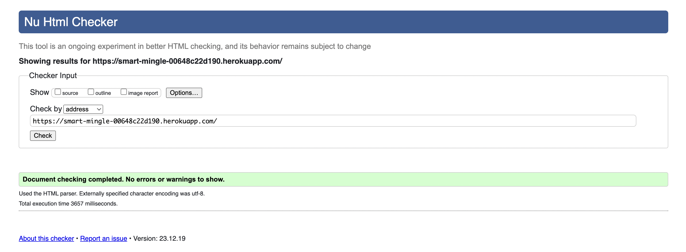 | Pass: No Errors, No warning |
| Contact Us   |  | Pass: No Errors, No warning |
| Event        | 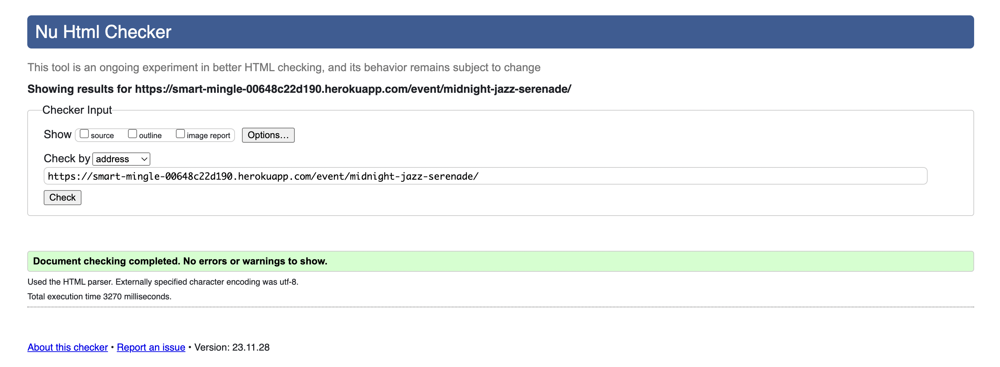 | Pass: No Errors, No warning |
| Create Event |  | Pass: No Errors, No warning |
| Search       |  | Pass: No Errors, No warning |
| Sign up      | 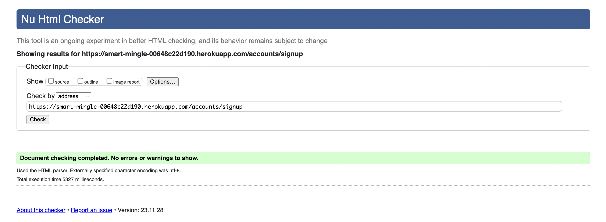 | Pass: No Errors, No warning |
| Login        | 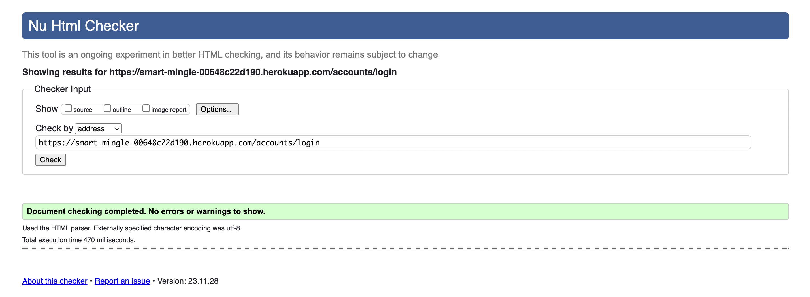 | Pass: No Errors, No warning |
| user         | 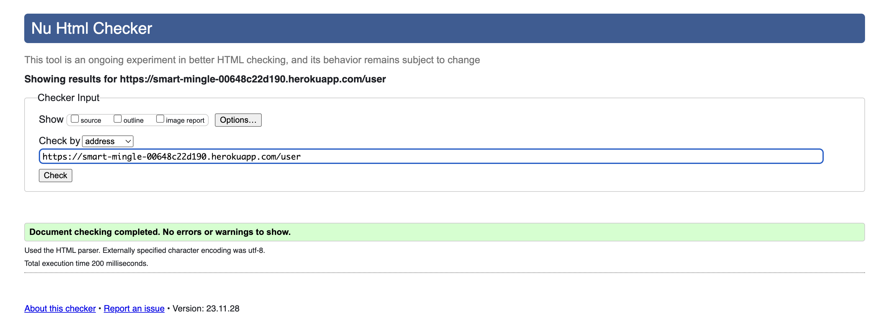 | Pass: No Errors, No warning |
| 404          | 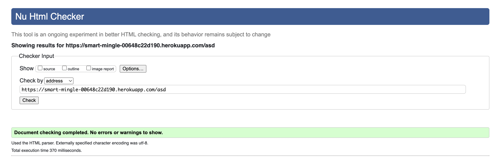 | Pass: No Errors, No warning |

### CSS

Results from [CSS Jigsaw Validator](https://jigsaw.w3.org/css-validator) for CSS file validation

| File       | Screenshot                                        | Notes           |
|------------|---------------------------------------------------|-----------------|
| styles.css |  | Pass: No Errors, No warning  |

### JavaScript

Results from [JShint Validator](https://jshint.com) for JS validation

| File      | Screenshot                           | Notes                        |
|-----------|--------------------------------------|------------------------------|
| script.js | 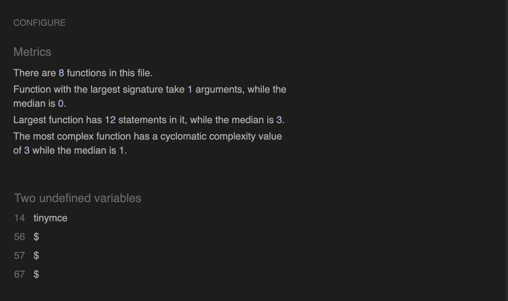 | Pass: No Errors, No warning  |

### Python

Results from [PEP8 CI Python Linter](https://pep8ci.herokuapp.com) for python validation

| File      | CI URL                                  | Screenshot                           | Notes                       |
|-----------|-----------------------------------------|--------------------------------------|-----------------------------|
| views.py  | [PEP8 CI](https://pep8ci.herokuapp.com) | 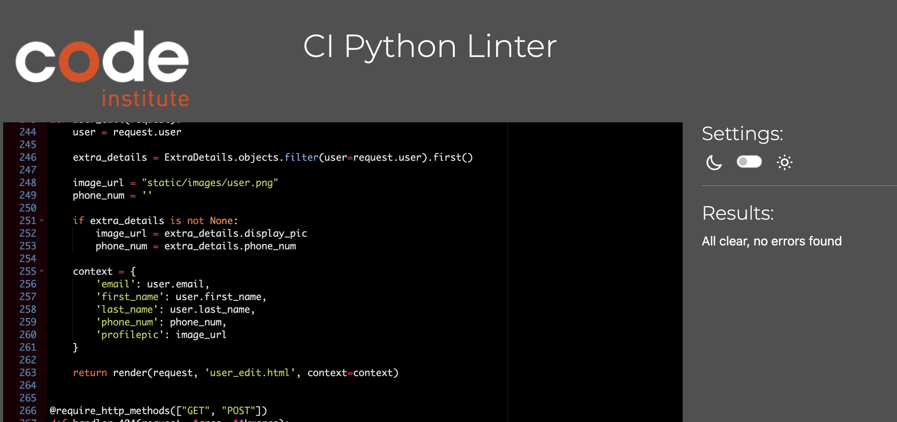 | Pass: No Errors, No warning |
| models.py | [PEP8 CI](https://pep8ci.herokuapp.com) | 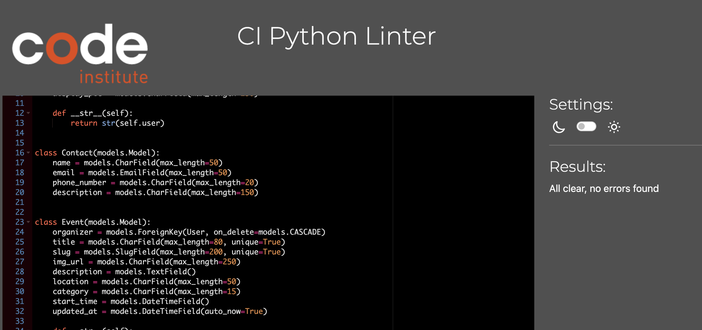 | Pass: No Errors, No warning |
| urls.py   | [PEP8 CI](https://pep8ci.herokuapp.com) | 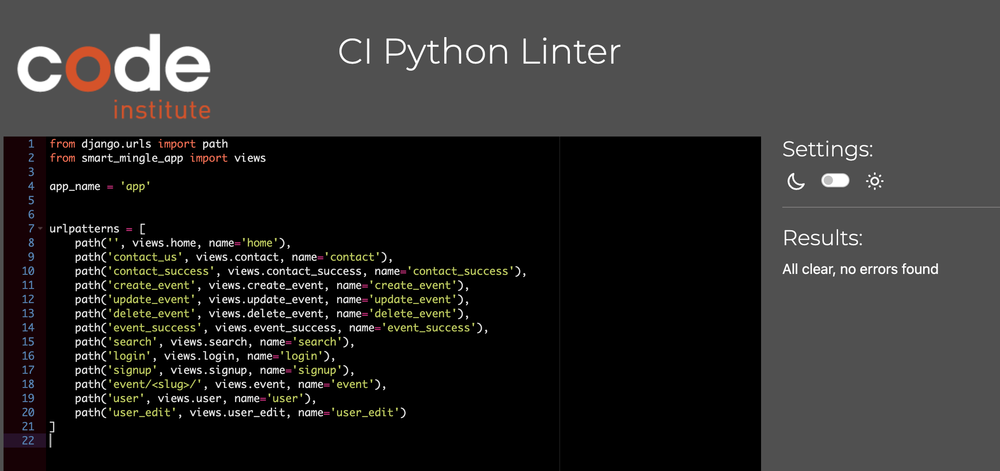 | Pass: No Errors, No warning |
| forms.py  | [PEP8 CI](https://pep8ci.herokuapp.com) | 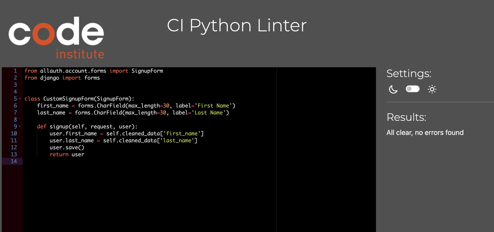 | Pass: No Errors, No warning |

## Browser Compatibility

Compatibility with various browsers have also been tested manually and site passed all criterias.

## Manual test for responsive

Aggressive manual test has been performed to check responsiveness of site

## Speed Testing

| url                                             | CI URL                                               | Screenshot                            | Notes            |
|-------------------------------------------------|------------------------------------------------------|---------------------------------------|------------------|
| https://smart-mingle-00648c22d190.herokuapp.com/ | [Speed](https://tools.pingdom.com/#6325095843c00000) |   | 580 ms load time |

## Lighthouse Results

Lighthous chrome extension has been used to test the site

| Page       | Size    | Screenshot                            | 
|------------|---------|---------------------------------------|
| Home       | Mobile  | 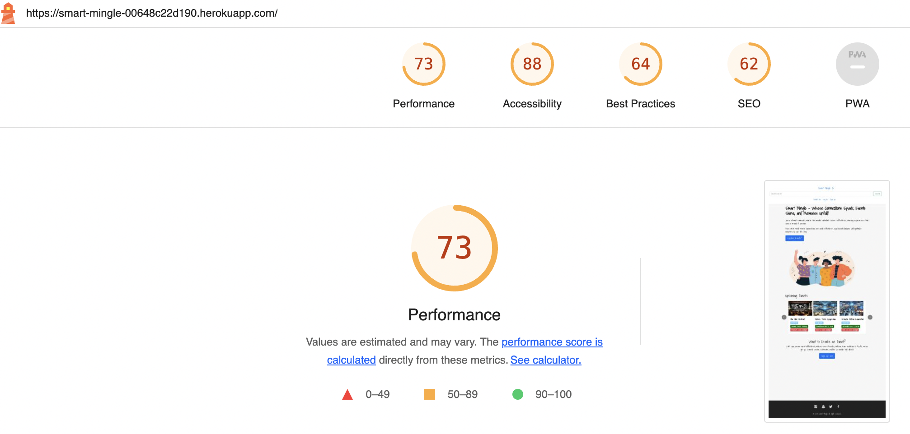  | 
| Home       | Desktop | 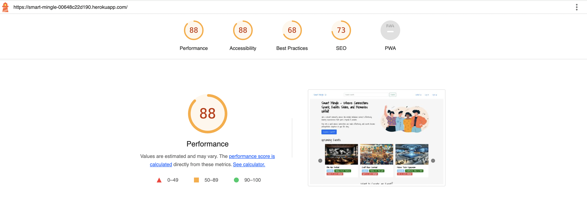 | 
| Contact Us | Mobile  | 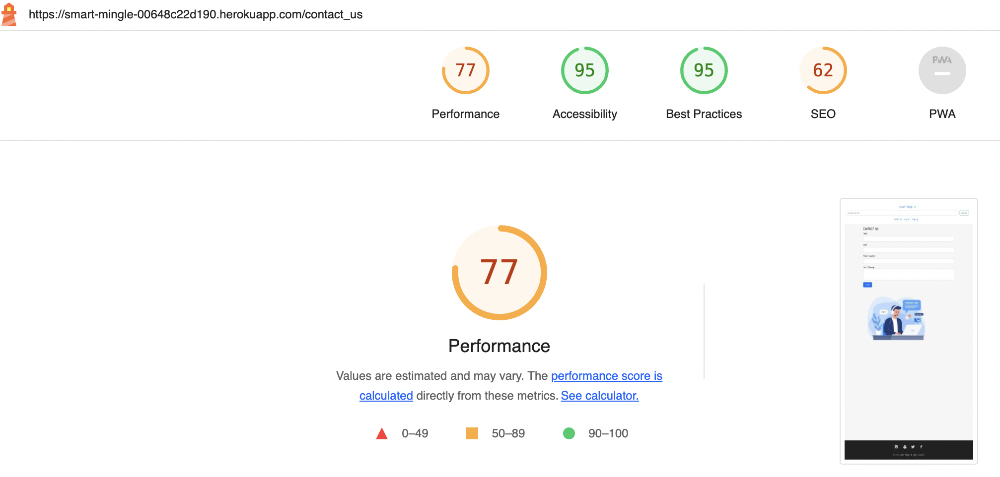  | 
| Contact Us | Desktop | 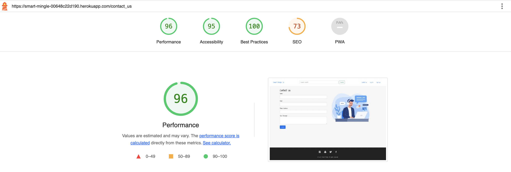 | 
| Sign Up    | Mobile  | 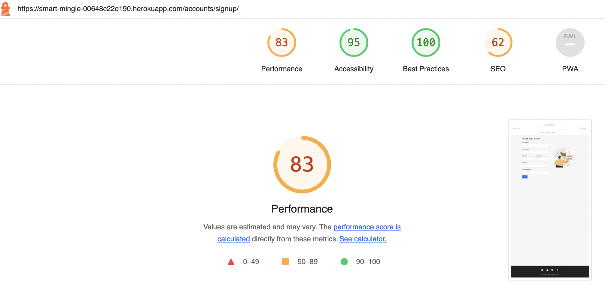  | 
| Sign Up    | Desktop | 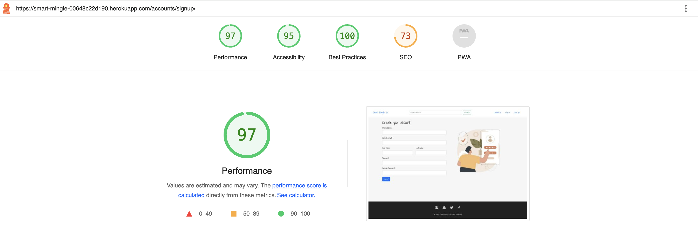 | 
| Login      | Mobile  | 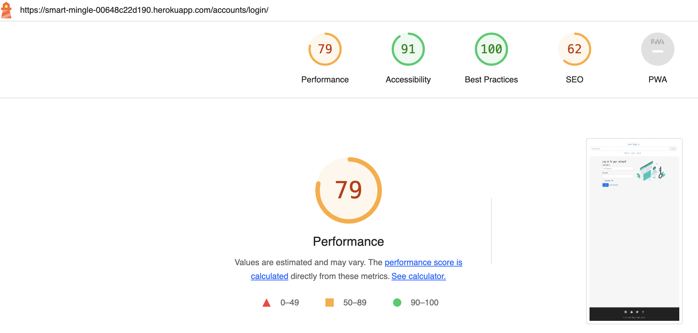  | 
| Login      | Desktop | 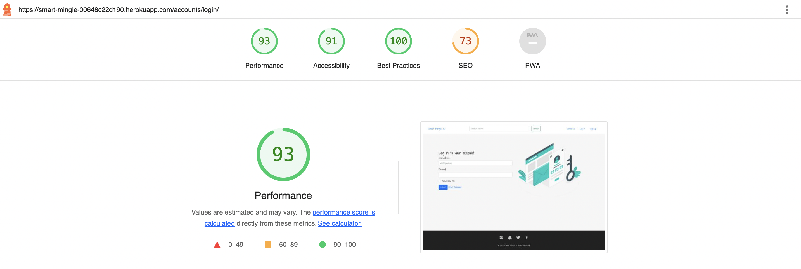 | 
| Search     | Mobile  | 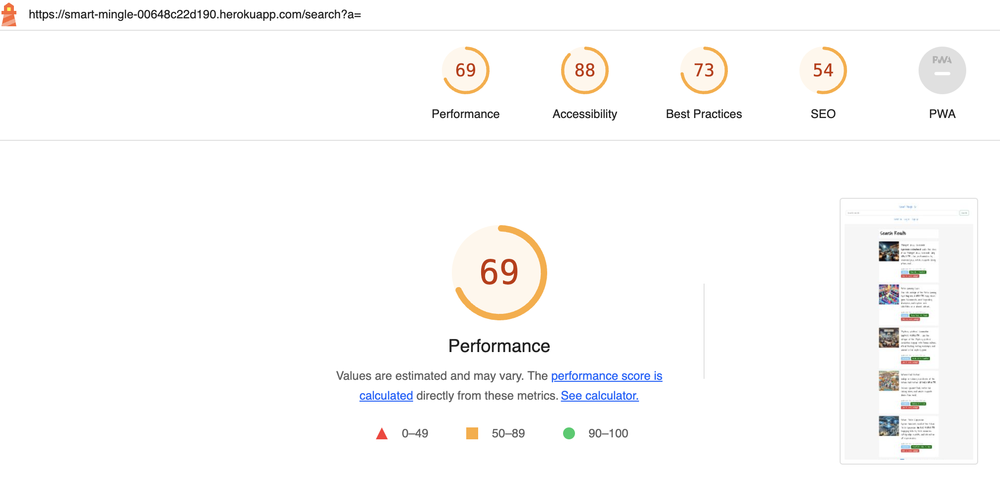  | 
| Search     | Desktop | 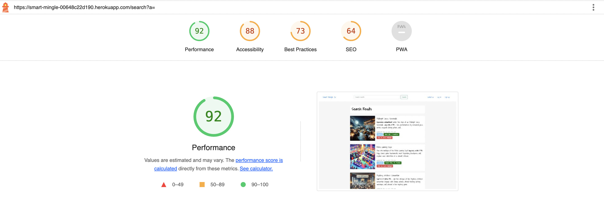 | 
| Event      | Mobile  | 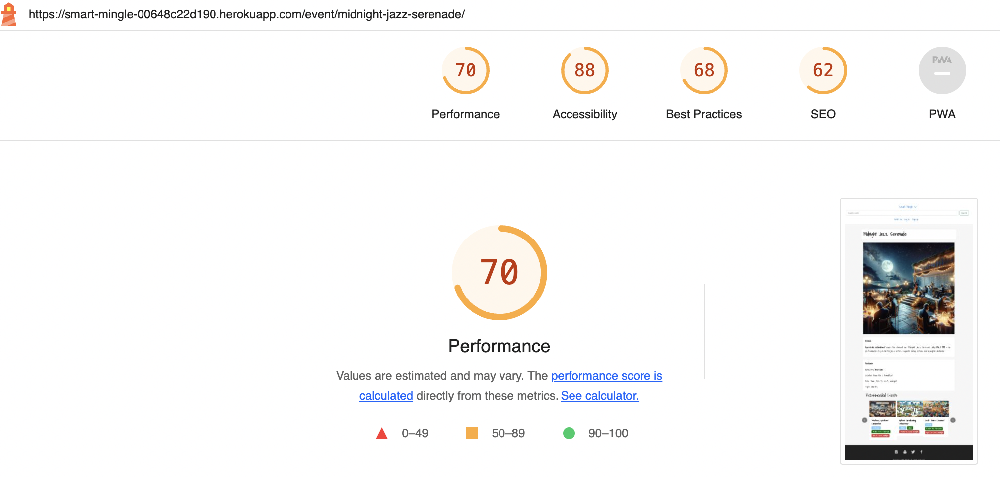  | 
| Event      | Desktop | 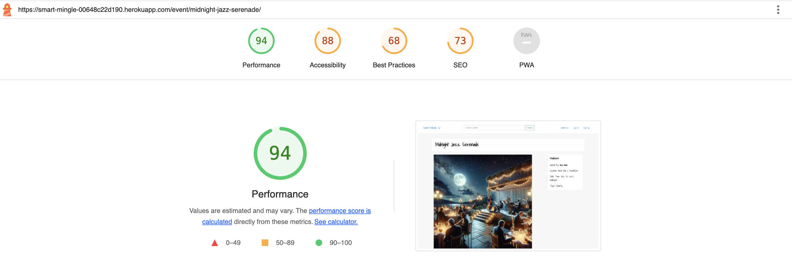 | 

## Python (PyTest)

### Setting Up Pytest

#### 1. Install pytest and pytest-django

If not already installed, you can install these packages using pip:

```bash
pip install pytest pytest-django
```

#### 2. Create Database

Create database for testing you can also use docker to create one using following command

```bash
docker run -it -d --name <database-name> -p <port>:<port> -e POSTGRES_PASSWORD=<password> <user-name>
```

#### 3. Provide credentials

Provide following configuration in env.py

````bash
os.environ['TEST_DB_NAME'] = < TEST_DB_NAME >
os.environ['TEST_DB_USERNAME'] = < TEST_DB_USERNAME >
os.environ['TEST_DB_PASSWORD'] = < TEST_DB_PASSWORD >
os.environ['TEST_DB_HOST'] = < TEST_DB_HOST >
os.environ['TEST_DB_PORT'] = < TEST_DB_PORT >
````

#### 4. Running Tests

To run your tests, use the following command in your terminal:

```bash
pytest
```

To run a single test file

```bash
pytest smart_mingle_app/tests/<test-file-name>.py
```

#### Note !!

1. Ensure your test database is set up and accessible.
2. When running tests, ensure your environment variables are correctly set, especially if you're using a separate test
   database configuration.
3. Coverage reports are auto generated when using pytest

## Pytest Results

20 test cases have been provided in smart_mingle_app/tests folder

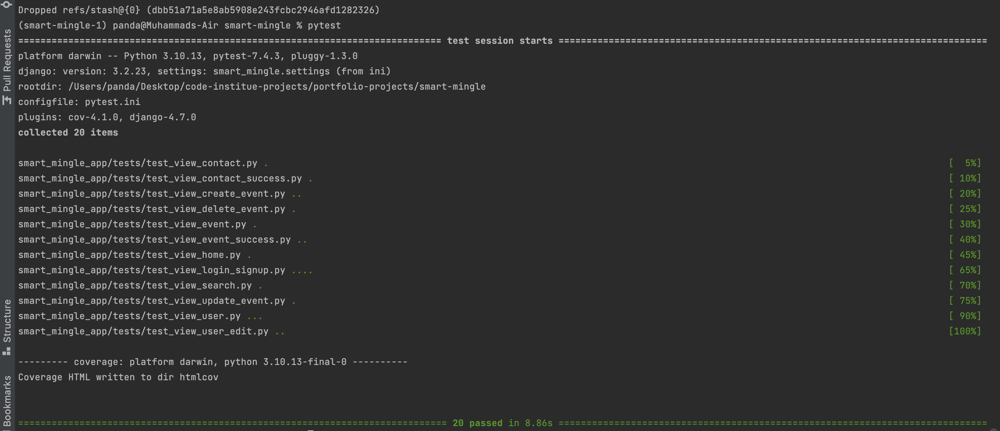

## Pytest Coverage

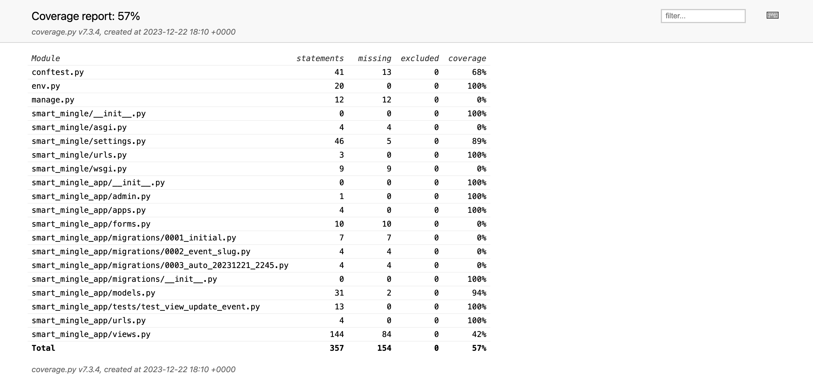

## Bugs

- Date time was setuped in one attribute while the html required two inputs.

  - Issue: datetime was not saved in database event table
  - Fix: Had to join time when creating and updating event using `strptime` and when it needs to render 
  had to strftime to divide into date and time
  
- Description saved from tiny-mce was shown incorrectly not as user defined
  - Issue: Description display was incorrect due to it being string
  - Fix: By autoescaping description in a `autoescape` tag provided from django templates

## Unfixed Bugs

- Unable to upload large image size on cloudinary.
- No other known bugs